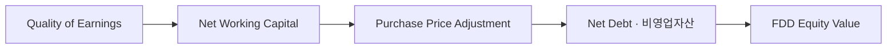
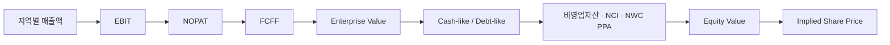
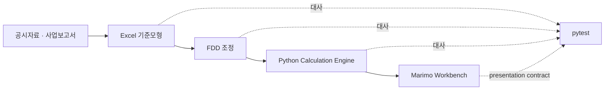

# Orion Valuation & FDD Workbench

주식회사 오리온(**271560, KOSPI**)의 2025년 K-IFRS 연결재무제표를 기반으로 구축한 **DCF Valuation + Financial Due Diligence (FDD) + Transaction Price Review** 프로젝트입니다.

Excel 기준모형을 Python으로 재계산하고, Marimo에서 **영업가치 산정 → 시장가치 교차검증 → Quality of Earnings → Net Working Capital → Net Debt·비영업자산 → FDD-adjusted Equity Value**까지 하나의 분석 흐름으로 연결했습니다.

[▶ Live App — Orion Valuation & FDD Workbench](https://molab.marimo.io/notebooks/nb_qRDYP1JABBx1UYjTPS5kw5/app)

> 평가기준일: 2025년 12월 31일  
> Current Share Price 기준일: 2026년 8월 21일  
> 표시통화: 백만원(주당가치: 원)  
> 핵심 방법론: FCFF DCF · Trading Comps · Historical Multiples · Reverse DCF · FDD

---

## Executive snapshot

| 핵심 지표 | Base Case |
|---|---:|
| WACC | 9.48% |
| Terminal Growth Rate | 2.00% |
| 2026E FCFF | 269,051백만원 |
| Enterprise Value (EV) | 6,530,454백만원 |
| FDD Equity Adjustment | 2,884,570백만원 |
| Equity Value | 9,415,024백만원 |
| Implied Share Price | **238,181원** |
| Current Share Price | 125,000원 |
| Market Price 대비 괴리 | **+90.5%** |
| 계속기업가치 비중 | 74.8% |

Base Case는 단순 DCF 산출값을 곧바로 주주가치로 사용하지 않습니다. 영업가치인 Enterprise Value에 대해 **Cash-like / Debt-like, 비영업자산, 비지배지분, NWC 가격조정**을 별도로 검토한 뒤 Equity Value로 연결합니다.

---

## FDD 핵심 조정

### 1. Quality of Earnings (QoE)

2025A Reported EBITDA에서 반복가능한 영업성과와 직접 관련되지 않는 항목을 분리하여 FDD EBITDA를 산정합니다.

| 항목 | 2025A |
|---|---:|
| Reported EBITDA | 722,874백만원 |
| 비영업 임대수익 재분류 | (4,272)백만원 |
| FDD EBITDA | **718,602백만원** |

현재 확인된 핵심 조정은 비영업 임대수익 재분류이며, 해당 조정은 2026E~2030E 전망의 EBIT·D&A에도 연결됩니다. 대시보드에서는 2023A~2025A 기간을 선택해 QoE 추이를 비교할 수 있습니다.

### 2. Net Working Capital (NWC) / Purchase Price Adjustment (PPA)

| 항목 | 금액 |
|---|---:|
| Normalized NWC Peg | 117,489백만원 |
| Closing NWC | 116,509백만원 |
| NWC Gap | (980)백만원 |
| Base Case 적용 PPA | 0백만원 |

정상화 운전자본 수준과 Closing NWC의 차이를 계산한 뒤, 거래가격 반영률을 별도 변수로 관리합니다. Base Case에서는 NWC 가격조정 적용률을 0%로 두고, Page 5에서 overlay 방식으로 즉시 sensitivity를 확인할 수 있습니다.

### 3. Net Debt · 비영업자산 · Equity Bridge

| 항목 | 금액 |
|---|---:|
| Cash-like | 1,235,818백만원 |
| Debt-like | 49,203백만원 |
| Net Cash | **1,186,615백만원** |
| 비영업자산 | 1,801,499백만원 |
| 비지배지분 | (103,544)백만원 |
| NWC 가격조정 | 0백만원 |
| FDD Equity Adjustment | **2,884,570백만원** |

주요 구성항목에는 단기금융상품, 리스부채, Capex 관련 미지급금, 리가켐바이오 시장가치 등이 포함됩니다. 이를 통해 **Enterprise Value 6,530,454백만원 → Equity Value 9,415,024백만원 → 주당 내재가치 238,181원**으로 연결됩니다.

---

## Dashboard 구성

대시보드는 다섯 개의 Chapter로 구성됩니다.

### 1. 가치평가 개요

- Implied Share Price와 Current Share Price 비교
- Enterprise Value · Equity Value · WACC 요약
- 2026E~2030E FCFF 및 영업이익률 전망
- Enterprise Value에서 Equity Value로의 연결

### 2. 계산구조

- 지역별 매출액 → EBIT → NOPAT → FCFF → Enterprise Value → Equity Value → Implied Share Price
- 단계별 가치평가 산식과 실제 수치 대입
- Excel 기준모형과 Python 계산결과 대사
- EBIT-to-FCFF Waterfall
- 법인세·D&A·Capex·NWC의 현금흐름 효과

### 3. 시나리오 및 주요 가정 검토

- 기준 시나리오와 독립 가치평가 범위 비교
- Revenue CAGR · EBIT Margin · WACC · 영구성장률 직접 조정
- WACC–Terminal Growth Rate 민감도
- 주요 가정 변화가 주당가치와 valuation range에 미치는 영향
- 회계추정치 검토 프레임워크를 활용한 assumption challenge

### 4. 시장가치 검증

- 국내외 식품 Trading Comps 비교
- FY2026E EV/EBITDA · EV/EBIT · P/E
- Levered Beta → Unlevered Beta → Relevered Beta
- DCF · Trading Comps · Historical Multiples Football Field
- Reverse DCF를 통한 현재 주가의 내재 가정 추정
- 성장률–마진 trade-off 분석

### 5. FDD 및 거래가격 검토

Page 5는 단순 요약 화면이 아니라 거래가격 검토를 위한 **integrated FDD workbench**입니다.

**분석 흐름**



주요 기능:

- 2023A~2025A QoE reference selection
- Reported EBITDA → FDD EBITDA normalization
- NWC Peg · Closing NWC · NWC Gap 검토
- Cash-like / Debt-like classification
- 비영업자산 및 NCI 조정
- FDD Equity Value Bridge
- Forecast normalization 확인
- 리가켐바이오 인정률, 단기금융상품 Cash-like 인정률, NWC 가격조정 적용률을 이용한 temporary overlay sensitivity

---

## 가치평가 및 거래가격 연결 구조



```text
NOPAT = EBIT × (1 − 정상화 현금법인세율)

FCFF = NOPAT
     + D&A
     − Capex
     − ΔNWC

Enterprise Value
= 추정기간 FCFF 현재가치
+ 계속기업가치 현재가치

Net Cash
= Cash-like
− Debt-like

FDD Equity Adjustment
= Net Cash
+ 비영업자산
− 비지배지분
+ 적용 NWC 가격조정

Equity Value
= Enterprise Value
+ FDD Equity Adjustment

Implied Share Price
= Equity Value ÷ 유통주식수
```

---

## 분석 아키텍처

대시보드는 표현 계층이고, 계산은 Excel 기준모형과 Python 모듈에서 수행됩니다. Page 5 역시 별도 valuation engine을 만들지 않고, **단일 `run_orion_dcf()` 실행결과의 `model["FDD"]`, `model["전망"]`, `model["DCF"]`, `model["지분가치"]`를 그대로 사용**합니다.

| 구성요소 | 역할 |
|---|---|
| [`orion_dashboard.py`](orion_dashboard.py) | Marimo 기반 5-page interactive workbench |
| [`dashboard_components.py`](dashboard_components.py) | Dashboard data contract, FDD review data, overlay 계산 |
| [`orion_dcf.py`](orion_dcf.py) | 전체 Valuation/FDD 계산의 단일 orchestration layer |
| [`fdd_model.py`](fdd_model.py) | QoE, NWC, Cash-like/Debt-like, 비영업자산 및 transaction bridge 추출 |
| [`forecast_model.py`](forecast_model.py) | 지역별 매출 및 영업이익 전망 |
| [`cash_flow_model.py`](cash_flow_model.py) | Capex, D&A, NWC 계산 |
| [`fcff_model.py`](fcff_model.py) | NOPAT 및 FCFF 산출 |
| [`valuation_model.py`](valuation_model.py) | WACC, DCF 및 Enterprise Value 산출 |
| [`equity_bridge.py`](equity_bridge.py) | EV에서 FDD-adjusted Equity Value로의 연결 |
| [`market_calibration.py`](market_calibration.py) | Trading Comps, Beta, Football Field, Reverse DCF |
| [`data/raw/orion_dcf.xlsx`](data/raw/orion_dcf.xlsx) | K-IFRS 재무정보, Valuation 가정, FDD 조정이 포함된 Excel 기준모형 |
| [`data/metadata/market_calibration.csv`](data/metadata/market_calibration.csv) | 시장가치 검증 input |
| [`tests/`](tests/) | 계산, 데이터 계약, UI presentation contract 및 regression 검증 |

### 데이터 및 통제 흐름



---

## 검증 및 재현성

현재 Base Case는 Excel과 Python이 사실상 동일하게 대사되도록 고정되어 있습니다.

| 검증 항목 | 기준 |
|---|---|
| Excel workbook SHA-256 | `f4015e03f47c116c04d51b032d1f1021c7a7186492bac56b4130713303b0251d` |
| WACC | 9.477625% |
| 2026E FCFF | 269,051.075백만원 |
| DCF Enterprise Value | 6,530,454.168백만원 |
| Equity Value | 9,415,024.166백만원 |
| Implied Share Price | 238,181.453원 |
| Regression suite | **206 tests passed** |

검증 범위에는 다음이 포함됩니다.

- Excel 입력 workbook fingerprint 검증
- FDD 필수 cached value 및 Excel error 검증
- QoE · NWC · transaction bridge reconciliation
- Forecast의 FDD-adjusted EBIT · D&A · Capex · NWC · FCFF 연결
- FCFF 및 DCF 계산 대사
- EV → Equity Value → Implied Share Price 대사
- Trading Comps · Beta · Reverse DCF 계산
- 주요 assumption 변화의 방향성 검증
- Page 1~5 presentation contract
- Page 5가 별도 Excel reload나 별도 FDD valuation engine 없이 단일 model contract를 사용하는지 검증

---

## 로컬 실행

```powershell
git clone https://github.com/hahnjune0118/Orion_DCF_Valuation.git
cd Orion_DCF_Valuation

python -m venv .venv
.\.venv\Scripts\Activate.ps1

python -m pip install -r requirements.txt

python -m pytest -q
python -m marimo check orion_dashboard.py
python -m marimo run orion_dashboard.py
```

Marimo 편집 화면에서 셀 의존관계와 계산식을 확인하려면:

```powershell
python -m marimo edit orion_dashboard.py
```

---

## 주요 가정과 한계

- 본 프로젝트는 공개 공시자료를 기반으로 수행한 **Public FDD / Valuation exercise**이며 실제 매도인·매수인 data room 접근을 전제로 한 FDD가 아닙니다.
- QoE, NWC, Net Debt 및 비영업자산 분류는 공개자료에서 확인 가능한 범위 내에서 수행했습니다.
- 매출 성장률, EBIT Margin, 정상화 현금법인세율, D&A, Capex 및 NWC는 공시자료와 분석가 가정을 결합하여 추정했습니다.
- WACC와 Terminal Growth Rate는 평가시점의 시장환경 변화에 따라 재산정되어야 합니다.
- Trading Comps 및 market calibration input은 특정 기준일의 snapshot이며 실제 거래·투자 판단 전 최신 데이터로 갱신해야 합니다.
- 리가켐바이오 등 비영업자산의 인정률은 거래구조와 실제 회수가능성에 따라 달라질 수 있습니다.
- NWC PPA는 실제 SPA의 정의, peg, collar 및 closing accounts mechanism에 따라 달라질 수 있습니다.
- Reverse DCF는 선택한 정상 영업이익률과 비영업자산 가치인식률에 조건부입니다.
- 본 프로젝트는 교육 및 포트폴리오 목적이며 투자권유, 공정가치 의견, 실제 FDD 보고서 또는 감사의견이 아닙니다.

---

## 프로젝트 목적

이 프로젝트는 단순 목표가격 산출보다 **기업가치평가와 거래가격 조정이 어떻게 하나의 모델 안에서 연결되는지**를 구현하는 데 목적이 있습니다.

핵심적으로 보여주고자 한 역량은 다음과 같습니다.

- K-IFRS 재무제표를 FCFF 기반 Valuation 모델로 전환
- Excel 기준모형을 Python으로 독립 재계산하고 대사
- DCF · Trading Comps · Historical Multiples · Reverse DCF를 이용한 시장 교차검증
- QoE를 통한 반복가능한 영업성과 normalization
- NWC Peg와 Closing NWC를 이용한 Purchase Price Adjustment 검토
- Cash-like / Debt-like 및 비영업자산 분류를 통한 Equity Bridge 설계
- FDD 조정을 Forecast와 최종 Equity Value에 실제 반영
- pytest 기반 regression control과 재현 가능한 model governance 구축
- Marimo를 이용해 복잡한 valuation/FDD workflow를 interactive workbench로 구현
