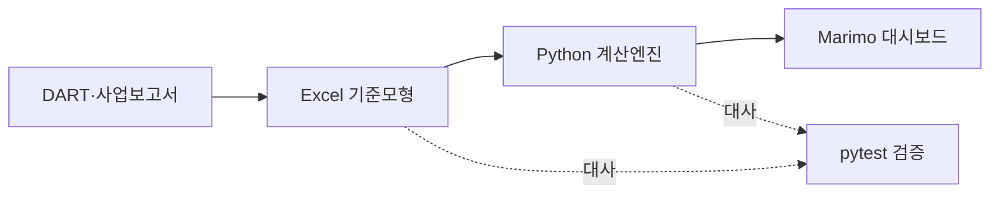

# Orion DCF Valuation Dashboard

오리온의 2025년 K-IFRS 연결재무제표를 기반으로 구축한 **FCFF 기준 DCF 가치평가 대시보드**입니다.  
지역별 매출액 전망부터 기업가치·지분가치·주당 내재가치까지 하나의 분석 체계로 연결하고, 주요 가정의 변화가 가치평가 결과에 미치는 영향을 대화형 시각화로 구현했습니다.

[▶ 대화형 가치평가 대시보드 실행](https://molab.marimo.io/github/hahnjune0118/Orion_DCF_Valuation/blob/main/orion_dashboard.py/server)

> 평가기준일: 2025년 12월 31일 · 표시통화: 백만원(주당가치: 원) · 평가방법: FCFF 기준 DCF

## Executive valuation snapshot

| 핵심 지표 | 기준 시나리오 |
|---|---:|
| WACC | 9.48% |
| 영구성장률 | 2.00% |
| 기업가치 | 6,774,772백만원 |
| 순비영업 조정액 | 2,898,257백만원 |
| 지분가치 | 9,673,029백만원 |
| 주당 내재가치 | 244,708원 |
| 2025년 12월 평균주가 | 104,330원 |
| 내재 상승여력 | 134.6% |
| 계속기업가치 비중 | 74.6% |

### 핵심 해석

- 오리온의 영업가치는 지역별 매출액 성장, 영업이익률 및 재투자 수준에 의해 결정됩니다.
- 지분가치는 기업가치에 초과현금, 단기금융상품, 리가켐바이오 시장가치 등 비영업자산을 가산하고 리스부채와 비지배지분을 차감하여 산정했습니다.
- 계속기업가치가 기업가치의 74.6%를 차지하므로 WACC와 영구성장률이 핵심 가치변동요인입니다.
- 기준 결과는 단일 목표가격이 아니라 가정에 조건부인 가치평가 기준점입니다. 대시보드의 민감도분석과 시나리오 분석을 함께 해석해야 합니다.

## Dashboard 구성

대시보드는 장문의 분석 노트가 아니라, 실무 검토자가 한두 화면에서 결론과 주요 변동요인을 파악할 수 있도록 구성했습니다.

1. **Valuation headline** — 기업가치, 지분가치, 주당 내재가치, 상승여력
2. **WACC–영구성장률 민감도분석** — 핵심 장기가정 변화에 따른 주당 내재가치 범위
3. **사업 시나리오 비교** — 매출액 성장률과 영업이익률 조정에 따른 가치 변화
4. **FCFF 전망** — NOPAT, D&A, Capex 및 NWC 증감이 현금창출력에 미치는 영향
5. **기업가치–지분가치 조정표** — 비영업자산과 차감항목의 가치 연결

## 가치평가 논리


```text
NOPAT = EBIT × (1 − 정상화 현금법인세율)

FCFF = NOPAT
     + 감가상각비
     − 자본적지출
     − 순운전자본 증감

기업가치 = 추정기간 FCFF 현재가치 + 계속기업가치 현재가치

지분가치 = 기업가치 + 비영업자산 − 금융부채 − 비지배지분

주당 내재가치 = 지분가치 ÷ 유통주식수
```

## 재현 가능한 분석 체계

대시보드는 표현 계층이고, 계산은 별도의 Python 모듈과 Excel 기준모형에서 수행됩니다. 이러한 분리는 **계산 논리**, **표시 논리**, **검증 논리**를 독립적으로 검토할 수 있게 합니다.

| 구성요소 | 역할 |
|---|---|
| [`orion_dashboard.py`](orion_dashboard.py) | Marimo 기반 대화형 시각화 및 가정 조정 |
| [`orion_dcf.py`](orion_dcf.py) | 전체 가치평가 모듈의 통합 실행 |
| [`forecast_model.py`](forecast_model.py) | 지역별 매출액·EBIT·NWC 전망 |
| [`cash_flow_model.py`](cash_flow_model.py) | 영업현금흐름 구성요소 계산 |
| [`fcff_model.py`](fcff_model.py) | NOPAT 및 FCFF 산출 |
| [`valuation_model.py`](valuation_model.py) | FCFF 할인, 계속기업가치 및 기업가치 산출 |
| [`equity_bridge.py`](equity_bridge.py) | 기업가치에서 지분가치 및 주당가치로의 연결 |
| [`data/raw/orion_dcf.xlsx`](data/raw/orion_dcf.xlsx) | K-IFRS 재무정보와 분석가 가정을 포함한 Excel 기준모형 |
| [`tests/`](tests/) | 계산식, 방향성 및 Excel–Python 일치 여부 검증 |

### 데이터 및 통제 흐름



주요 통제는 다음과 같습니다.

- Excel 기준모형과 Python 산출값의 재계산 검증
- FCFF 구성요소와 가치평가 결과의 허용오차 검증
- 매출액 성장률·영업이익률·WACC 변화에 대한 방향성 검증
- 기업가치에서 지분가치로의 연결 검증
- 2026~2030년 전망기간 및 주요 가정의 완전성 검증

현재 자동화 검증은 **18개 테스트**로 구성되어 있습니다.

## 로컬 실행

```powershell
git clone https://github.com/hahnjune0118/Orion_DCF_Valuation.git
cd Orion_DCF_Valuation

python -m venv .venv
.\.venv\Scripts\Activate.ps1
python -m pip install -r requirements.txt
python -m pip install marimo==0.23.16

python -m pytest -q
python -m marimo run orion_dashboard.py
```

Marimo 편집 화면에서 계산식과 셀 간 의존관계를 검토하려면 다음 명령을 사용합니다.

```powershell
python -m marimo edit orion_dashboard.py
```

## 주요 가정과 한계

- 매출액 성장률, 영업이익률, 정상화 현금법인세율, D&A, Capex 및 NWC는 공시자료와 분석가 가정을 결합하여 추정했습니다.
- WACC와 영구성장률은 시장자료 및 예시 가정에 기초하며, 평가시점의 시장환경 변화에 따라 갱신되어야 합니다.
- 비상장·관계기업투자와 투자부동산 등 비영업자산의 공정가치는 별도의 상세 가치평가가 필요할 수 있습니다.
- 본 프로젝트는 교육 및 포트폴리오 목적으로 작성되었으며 투자 권유 또는 공식 공정가치 의견이 아닙니다.

## 분석 목적

본 프로젝트는 단순한 목표가격 제시보다 다음 실무 역량을 보여주는 데 목적이 있습니다.

- K-IFRS 재무제표를 가치평가 현금흐름으로 전환하는 능력
- Excel 기준모형을 독립적인 Python 계산엔진으로 재수행하는 능력
- 주요 가정과 가치변동요인을 경영진 관점에서 시각화하는 능력
- 계산 결과를 자동 검증하고 재현 가능한 분석기록을 유지하는 능력
