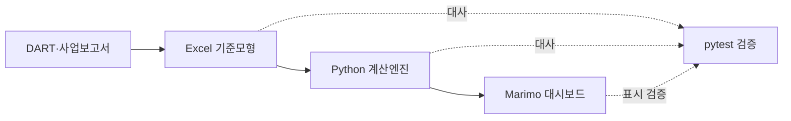

# Orion DCF Valuation Dashboard

주식회사 오리온(**271560, KOSPI**)의 2025년 K-IFRS 연결재무제표를 기반으로 구축한 **FCFF 기준 DCF 가치평가 및 독립적 추정 검토 대시보드**입니다.

지역별 매출액 전망에서 EBIT·NOPAT·FCFF를 거쳐 Enterprise Value (EV)·Equity Value·Implied Share Price에 도달하는 계산 구조를 구현했습니다. 또한 경영진 주장과 감사인의 전문가적 판단을 분리하여 주요 가정, Valuation Range 및 잠재적 왜곡표시를 대화형으로 검토할 수 있도록 설계했습니다.

[▶ 최신 대화형 가치평가 대시보드 실행](https://molab.marimo.io/notebooks/nb_7uHUTgLd6vYunzhsz7GrPW/app)

> 평가기준일: 2025년 12월 31일  
> Current Share Price 기준일: 2026년 8월 21일
> 표시통화: 백만원(주당가치: 원)  
> 평가방법: FCFF 기준 DCF

## Executive valuation snapshot

| 핵심 지표 | Valuation 시나리오 |
|---|---:|
| WACC | 9.48% |
| Terminal Growth Rate | 2.00% |
| Enterprise Value (EV) | 6,774,772백만원 |
| 순비영업 조정액 | 2,898,257백만원 |
| Equity Value | 9,673,029백만원 |
| Implied Share Price | 244,708원 |
| Current Share Price | 125,000원 |
| Current Share Price 기준일 | 2026년 8월 21일 |
| 내재 상승여력 | 95.8% |
| 계속기업가치 비중 | 74.6% |

### 핵심 해석

- Valuation 시나리오상 Implied Share Price는 **244,708원**으로, 2026년 8월 21일 Current Share Price **125,000원** 대비 **95.8%의 상승여력**을 시사합니다.
- 오리온의 영업가치는 지역별 매출액 성장률, EBIT Margin, 재투자 수준 및 운전자본 효율성에 의해 결정됩니다.
- Equity Value는 Enterprise Value (EV)에 초과현금, 단기금융상품, 리가켐바이오 시장가치 등 비영업자산을 가산하고 리스부채와 비지배지분을 차감하여 산정했습니다.
- 계속기업가치가 Enterprise Value (EV)의 74.6%를 차지하므로 WACC와 Terminal Growth Rate는 핵심 가치변동요인입니다.
- Implied Share Price는 단일한 목표가격이 아니라 방법·가정·데이터에 조건부인 추정치입니다. 따라서 감사인의 범위추정치 및 민감도 분석과 함께 해석해야 합니다.

## Dashboard 구성

대시보드는 실무 검토자가 결론, 계산 구조, 추정불확실성 및 시장 교차검증을 단계적으로 확인할 수 있도록 네 개의 Chapter로 구성했습니다.

### 1. 가치평가 개요

- Valuation headline
- Implied Share Price와 Current Share Price 비교
- Enterprise Value (EV)·Equity Value·WACC 요약
- 2026E~2030E FCFF 및 영업이익률 전망
- Enterprise Value (EV)에서 Equity Value로의 연결

### 2. 계산구조

- 지역별 매출액 → EBIT → NOPAT → FCFF → Enterprise Value (EV) → Equity Value → Implied Share Price의 계산 구조
- 단계별 가치평가 산식과 실제 수치 대입
- Excel 기준모형과 Python 재계산 결과의 대사
- 연도별 EBIT-to-FCFF Waterfall
- 영업관련 법인세, D&A, Capex 및 NWC 증감의 현금흐름 효과

### 3. 민감도 분석

- 경영진 주장과 감사인의 전문가적 판단 비교
- Revenue CAGR, EBIT Margin, WACC 및 Terminal Growth Rate의 직접 입력·Slider 조정
- 감사인이 도출한 Implied Share Price 범위추정치
- WACC–Terminal Growth Rate 민감도 분석
- 경영진 점추정치의 감사인 범위 포함 여부
- 감사인 범위를 벗어난 금액에 대한 동적 왜곡표시 계산
- 회계감사기준서 540 및 450의 관련 문단과 판단 근거 연결

### 4. 시장가치 검증

- 국내외 식품 Trading Comps 6개사와 평가대상 오리온의 FY2026E EV/EBITDA, EV/EBIT 및 P/E 비교
- 오리온 배수는 현재 주가 기준 시각적 비교에만 포함하며 Median·IQR·가치평가 범위에서는 제외
- Hamada 방식의 Levered Beta → Unlevered Beta → Orion 목표 자본구조 Relevered Beta
- Risk-free Rate, ERP 및 Country Risk Premium의 기준일·출처 프레임워크
- DCF Sensitivity, Trading Comps 및 FY2021–FY2025 Historical Multiples의 Valuation Range
- 방법론별 Implied Share Price를 비교하는 Football Field
- Reverse DCF는 현재 주가에 내재된 미래 영업가정을 역으로 추정하는 분석입니다.
- 하나의 가격으로 성장률과 마진을 동시에 식별할 수 없다는 점을 보여주는 마진–성장률 등가곡선

## 가치평가 계산 구조


```text
NOPAT = EBIT × (1 − 정상화 현금법인세율)

FCFF = NOPAT
     + 감가상각비
     − 자본적지출
     − 순운전자본 증감

Enterprise Value (EV) = 추정기간 FCFF 현재가치
         + 계속기업가치 현재가치

Equity Value = Enterprise Value (EV)
         + 비영업자산
         − 금융부채
         − 비지배지분

Implied Share Price = Equity Value ÷ 유통주식수
```

## Independent Review Framework

본 대시보드는 Valuation 모델의 산출뿐 아니라, 회계추정치에 대한 독립적인 검토 절차를 구현합니다.

| 검토 요소 | 경영진 주장 | 감사인의 전문가적 판단 |
|---|---|---|
| 방법 | FCFF 기준 DCF | 방법의 적합성 및 일관성 검토 |
| 가정 | 경영진의 성장률·수익성 가정 | 합리적인 대체 가정 및 민감도 적용 |
| 데이터 | 공시자료 및 전망 입력값 | 완전성·정확성·목적적합성 검토 |
| 결론 형태 | 단일 점추정치 | 하단·상단으로 구성된 범위추정치 |
| 평가 결과 | 주장된 Implied Share Price | 범위 포함 여부 및 잠재적 왜곡표시 |

감사인의 범위추정치는 네 가지 조정 가정에 따라 동적으로 변경됩니다.

- Revenue CAGR 조정
- EBIT Margin 조정
- WACC 조정
- Terminal Growth Rate 조정

경영진의 점추정치가 감사인의 범위추정치를 벗어나는 경우, 대시보드는 경영진 점추정치와 가장 가까운 범위 금액의 차이를 잠재적 왜곡표시로 계산합니다.

> 본 기능은 회계감사기준서 540의 회계추정치 감사 접근법과 회계감사기준서 450의 왜곡표시 평가 개념을 학습 목적으로 구현한 것입니다. 실제 감사절차 또는 감사의견을 구성하지 않습니다.

## 재현 가능한 분석 체계

대시보드는 표현 계층이며, 계산은 별도의 Python 모듈과 Excel 기준모형에서 수행됩니다. 이러한 구조는 **계산 논리**, **표시 논리**, **전문가적 판단** 및 **검증 논리**를 분리하여 검토할 수 있게 합니다.

| 구성요소 | 역할 |
|---|---|
| [`orion_dashboard.py`](orion_dashboard.py) | Marimo 기반 대화형 대시보드 및 감사인 범위추정 |
| [`dashboard_components.py`](dashboard_components.py) | 시각화 데이터 계약, 범위 비교 및 판단 로직 |
| [`market_calibration.py`](market_calibration.py) | Trading Comps 배수, Beta Relevering, Football Field 및 Reverse DCF 계산 |
| [`orion_dcf.py`](orion_dcf.py) | 전체 가치평가 모듈의 통합 실행 |
| [`forecast_model.py`](forecast_model.py) | 지역별 매출액·EBIT·NWC 전망 |
| [`cash_flow_model.py`](cash_flow_model.py) | 영업현금흐름 구성요소 계산 |
| [`fcff_model.py`](fcff_model.py) | NOPAT 및 FCFF 산출 |
| [`valuation_model.py`](valuation_model.py) | FCFF 할인, 계속기업가치 및 Enterprise Value (EV) 산출 |
| [`equity_bridge.py`](equity_bridge.py) | Enterprise Value (EV)에서 Equity Value 및 Implied Share Price로의 연결 |
| [`data/raw/orion_dcf.xlsx`](data/raw/orion_dcf.xlsx) | K-IFRS 재무정보와 Valuation 가정을 포함한 Excel 기준모형 |
| [`data/metadata/market_calibration.csv`](data/metadata/market_calibration.csv) | Trading Comps 배수·Beta screening input·기준일·출처 snapshot |
| [`tests/`](tests/) | 계산식, 데이터 계약, 방향성 및 표시 로직 검증 |

### 데이터 및 통제 흐름



주요 통제는 다음과 같습니다.

- Excel 기준모형과 Python 산출값의 재계산 검증
- NOPAT 및 FCFF 구성요소의 계산식 검증
- EBIT-to-FCFF 전환 금액의 대사
- Enterprise Value (EV)에서 Equity Value로의 연결 검증
- Implied Share Price와 유통주식수의 대사
- Revenue CAGR·EBIT Margin·WACC·Terminal Growth Rate 변화의 방향성 검증
- 감사인 범위 하단과 상단의 순서 및 계산 검증
- 경영진 점추정치의 범위 포함 여부 검증
- 범위 이탈 시 잠재적 왜곡표시 금액 검증
- Dashboard의 주요 문구와 표시 계약 검증
- Trading Comps 데이터 계약, Beta Relevering 및 Valuation Range 검증
- Reverse DCF의 Current Share Price 재대사와 비영업자산 가치인식률 방향성 검증
- Excel 입력파일의 SHA-256 기준선 검증

현재 자동화 검증은 **178개 테스트**로 구성되어 있습니다.

## 로컬 실행

```powershell
git clone https://github.com/hahnjune0118/Orion_DCF_Valuation.git
cd Orion_DCF_Valuation

python -m venv .venv
.\.venv\Scripts\Activate.ps1

python -m pip install -r requirements.txt
python -m pip install marimo==0.23.16

python -m pytest -q
python -m marimo check orion_dashboard.py
python -m marimo run orion_dashboard.py
```

브라우저에서 표시된 `localhost` 주소를 열어 대시보드를 검토할 수 있습니다.

Marimo 편집 화면에서 계산식과 셀 간 의존관계를 확인하려면 다음 명령을 사용합니다.

```powershell
python -m marimo edit orion_dashboard.py
```

## 주요 가정과 한계

- 매출액 성장률, EBIT Margin, 정상화 현금법인세율, D&A, Capex 및 NWC는 공시자료와 분석가 가정을 결합하여 추정했습니다.
- WACC와 Terminal Growth Rate는 시장자료 및 예시 가정에 기초하며, 평가시점의 시장환경 변화에 따라 갱신되어야 합니다.
- 공개 Trading Comps 배수는 FY2026E snapshot이며, Beta·D/E는 screening input입니다. 실제 보고서 발행 전 동일 데이터 공급자·관측기간·통화·회계기준으로 재수집해야 합니다.
- Trading P/E는 별도 순이익 전망이 없어 2026E NOPAT을 normalized earnings proxy로 사용하므로 보조적 교차검증으로만 해석합니다.
- Reverse DCF 결과는 선택한 Normalized EBIT Margin과 비영업자산 가치인식률에 조건부입니다. 이는 Revenue CAGR·마진·자산할인이 하나의 가격에 대해 여러 등가조합을 형성하는 식별 문제를 반영합니다.
- 비상장·관계기업투자와 투자부동산 등 비영업자산의 공정가치는 별도의 상세 가치평가가 필요할 수 있습니다.
- 감사인의 범위추정치는 선택된 조정 가정에 따른 분석 결과이며, 충분하고 적합한 감사증거에 기초한 실제 감사결론이 아닙니다.
- 잠재적 왜곡표시 금액은 대시보드상 범위추정치와 경영진 점추정치의 차이를 나타내며, 재무제표 전체의 중요성 판단을 포함하지 않습니다.
- 본 프로젝트는 교육 및 포트폴리오 목적으로 작성되었으며 투자 권유, 공정가치 의견 또는 감사의견이 아닙니다.

## 분석 목적

본 프로젝트는 단순한 목표가격 제시보다 다음과 같은 실무 역량을 보여주는 데 목적이 있습니다.

- K-IFRS 재무제표를 가치평가 현금흐름으로 전환하는 능력
- Excel 기준모형을 독립적인 Python 계산엔진으로 재수행하는 능력
- FCFF 기반 DCF 모델의 계산 구조를 설명하고 대사하는 능력
- 주요 가정의 변화가 가치평가 결과에 미치는 영향을 분석하는 능력
- DCF·Trading Comps·Historical Multiples의 결과 차이를 영업지표와 Equity Value 연결 관점에서 설명하는 능력
- Current Share Price가 내포하는 Revenue CAGR·Normalized EBIT Margin·비영업자산 할인 사이의 trade-off를 Reverse DCF로 분석하는 능력
- 경영진 점추정치와 감사인의 범위추정치를 비교하는 능력
- 회계추정치의 추정불확실성과 잠재적 경영진 편의를 검토하는 능력
- 계산 결과를 자동 검증하고 재현 가능한 분석기록을 유지하는 능력
