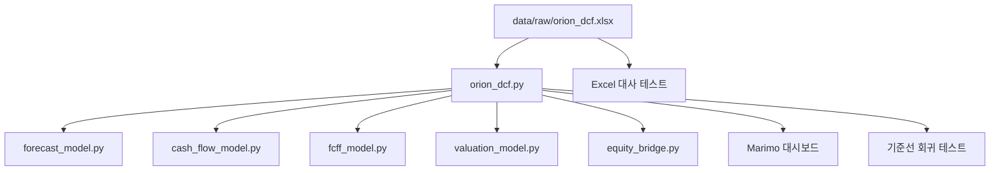

# 모델 구성 및 통제 목록

## 1. 아키텍처 개요

현재 `orion_dcf.py`가 Excel의 캐시값을 읽어 모든 계산 모듈을 조정한다. Excel, Python 계산엔진, 대시보드 표현계층은 파일상 분리되어 있으나 데이터 파싱과 실행 orchestration은 하나의 함수에 결합되어 있다.

## 2. 주요 파일

| 파일 | 역할 | 핵심 함수/출력 | 주요 의존성 | 현행 통제 |
|---|---|---|---|---|
| `data/raw/orion_dcf.xlsx` | 공시 재무정보, 가정 및 Excel 기준모형 | 14개 시트, 수식 677개 | Excel 계산 캐시 | Python 대사, SHA-256 |
| `orion_dcf.py` | 전체 모델 실행 및 모듈 조정 | `run_orion_dcf` | openpyxl, 아래 계산모듈 | End-to-end 및 기준선 테스트 |
| `forecast_model.py` | 지역별 매출액·영업이익 | `forecast_segment_revenue`, `calculate_operating_profit` | 없음 | 지역·EBIT 대사 |
| `cash_flow_model.py` | NWC 및 Capex·D&A | `calculate_nwc`, `calculate_capex_and_depreciation` | 없음 | 통합 FCFF 대사 |
| `fcff_model.py` | NOPAT 및 FCFF | `calculate_fcff` | 없음 | 연도별 Excel 대사 |
| `valuation_model.py` | WACC 및 DCF | `calculate_wacc`, `calculate_dcf` | 없음 | WACC, TV, EV 대사·예외 |
| `equity_bridge.py` | 기업가치→지분가치 | `calculate_equity_bridge` | 없음 | Excel 대사·주식수 예외 |
| `orion_dashboard.py` | Executive Marimo 대시보드 | KPI·민감도·시나리오·연결표 | marimo, pandas, plotly | marimo check |
| `orion_valuation_lab.py` | 상세 분석용 Marimo 노트북 | 모델 상세·분석 검토 | marimo, pandas, plotly | 일부 End-to-end 테스트 간접통제 |
| `reconcile_excel.py` | Excel FCFF 대사 유틸리티 | 연도별 차이 | openpyxl | 수동 실행 |
| `reconcile_forecast.py` | 전망 대사 유틸리티 | 전망 차이 | openpyxl | 수동 실행 |
| `scripts/capture_baseline.py` | 기준선·환경 증거 생성 | JSON, 환경 텍스트 | openpyxl, 모델모듈 | 명시적 `--write` |

## 3. Excel 시트 목록

| 순서 | 시트 | 용도 |
|---:|---|---|
| 1 | 개요 | 평가기준일, 정보기준일, 단위, 모델 convention |
| 2 | 요약 | 핵심 가치평가 결과 |
| 3 | 가정 | 지역별 성장률, 비용, 세율, 재투자, 운전자본, WACC |
| 4 | 과거재무제표 | 2023A~2025A K-IFRS 연결재무정보 |
| 5 | 매출액추정 | 지역별 매출액 전망 |
| 6 | 영업실적추정 | 매출원가·판매비·일반관리비·EBIT 전망 |
| 7 | NWC | 운전자본 구성 및 증감 |
| 8 | Capex_D&A | 유지보수·성장 Capex 및 D&A |
| 9 | WACC | 자기자본·타인자본비용 및 WACC |
| 10 | DCF | FCFF 할인과 계속기업가치 |
| 11 | 기업가치_지분가치 | 비영업자산·차감항목·주당가치 연결 |
| 12 | 민감도분석 | WACC와 영구성장률 민감도 |
| 13 | 검증 | Excel 내부 통제 |
| 14 | 출처 | 공시·가정의 근거 요약 |

## 4. 입력과 출력

### 주요 입력

- 과거 지역별 매출액과 2025년 NWC 기초잔액
- 지역별 매출액 성장률
- 매출원가율, 판매비율, 일반관리비율, 정상화 현금법인세율
- D&A/매출액, 유지보수 Capex/매출액, 성장 Capex
- DSO, 재고자산 회전일수, DPO 및 기타 영업유동항목 비율
- 무위험수익률, ERP, 베타, 국가위험프리미엄, 차입원가, 목표 자본구조
- 영구성장률, 필요 영업현금 비율
- 현금·금융상품·관계기업·투자부동산·차입금·리스부채·비지배지분·주식수

### 주요 출력

- 2026E~2030E 지역별·연결 매출액, EBIT, NWC, D&A, Capex, NOPAT, FCFF
- WACC 및 할인계수
- 추정기간 FCFF 현재가치, 계속기업가치 현재가치, 기업가치
- 순비영업 조정액, 지분가치, 주당 내재가치 및 내재 상승여력

## 5. 테스트 구조

| 테스트 파일 | 현재 목적 | 한계 |
|---|---|---|
| `test_operating_model.py` | 지역별 매출액·EBIT Excel 대사 | 경제적 가정의 타당성은 미검증 |
| `test_integrated_forecast.py` | 통합 FCFF 전망 대사 | 동일 Excel 캐시에 의존 |
| `test_fcff.py` | 연도별 FCFF 및 2028 NWC 회수 | 2028 회수의 경제적 근거는 미검증 |
| `test_valuation.py` | WACC·DCF 대사 및 WACC>g | 시장입력의 출처는 미검증 |
| `test_equity_bridge.py` | 지분가치 연결 및 주식수 예외 | 비영업자산 공정가치는 미검증 |
| `test_scenarios.py` | 상·하방 방향성 | 시나리오 확률·근거는 미검증 |
| `test_end_to_end.py` | 전체 결과 Excel 대사 | Excel과 Python의 공통오류 위험 |
| `test_baseline_snapshot.py` | 입력 지문과 현행 결과 변경 탐지 | 정확성 검증이 아니라 변경통제 |

## 6. 기준선 파일 지문

정확한 SHA-256, 파일크기 및 수정시각은 `artifacts/baseline/environment.txt`에 기록한다. 핵심 입력 Excel의 기준 지문은 다음과 같다.

`1e57dc7508b04b5e1c6ee546e8435634589427cc2828f0d9542806b394acde8d`

## 7. 모델 상태 해석

기준선 회귀 테스트의 통과는 **현행 구현이 변하지 않았음**을 의미한다. 경제적 가정, 공시 계보, 시장자료, IFRS 16 일관성 및 정상상태 논리가 타당하다는 독립 의견이 아니다. 이 구분은 implementation fidelity와 valuation validity를 분리하는 핵심 통제이다.
